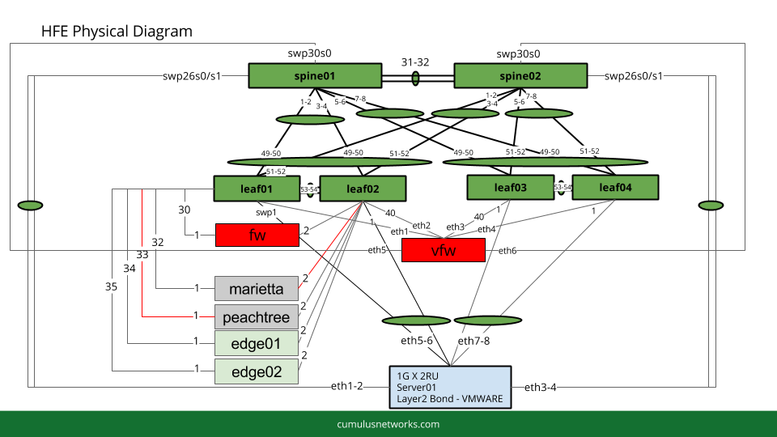
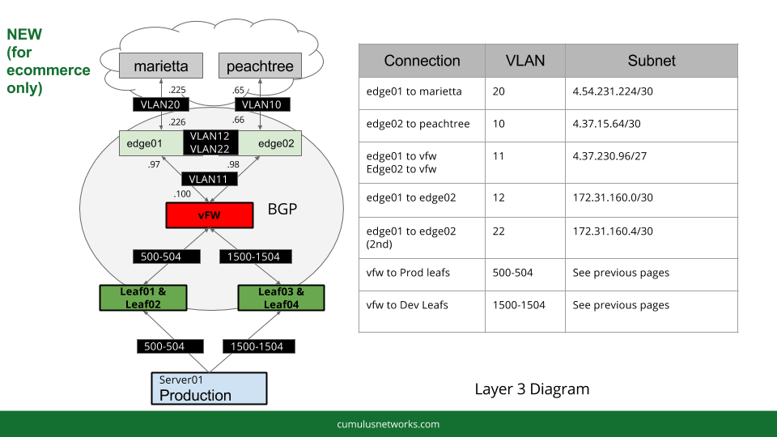

#Jumpstart Summary Report

###Prepared by Cumulus Networks® Professional Services

Presented to HFE  
September 9, 2016  
Sean Cavanaugh - Sr. Consultant  

##Customer

#Table of Conents

* [Executive Summary](#executive-summary)
  * [Participants](#participants)
* [Summary of Deliverables](#summary-of-deliverables)
* [Architecture Highlights](#architecture-highlights)
* [Overview](#overview)
  * [Design Choices](#design-choices)
  * [Simulation Environment](#simulation-environment)
* [Jumpstart Checklist](#jumpstart-checklist)
  * [Discovery Meeting](#discovery-meeting)
  * [Simulation Buildout](#simulation-buildout)
  * [Simulation Handoff and Syncs](#simulation-handoff-and-syncs)
  * [Wrap-Up](#wrap-up)
* [Questions & Answers](#questions--answers)
* [Future Recommendations](#future-recommendations)

#Executive Summary

The Cumulus Networks team performed a Remote Jumpstart consulting service with the Herschend Family Entertainment  team on August 2nd, 2016 through September 9th, 2016.. This service included knowledge transfer, review of data center architecture, simulation of network topology via vagrant, and flat file configurations in a GitHub directory for the customer to keep.

###Participants

| Name | Role | Company |
|---|---|---|
| Collin C. MacMillan | Director IT Infrastructure | Herschend Family Entertainment |
| Keith Gates | Network Engineer | Herschend Family Entertainment |
| Sean Cavanaugh | Senior Consultant | Cumulus Networks |
| Jeff Haydel | Systems Engineer | Cumulus Networks |

#Summary of Deliverables

| Topic | Comments |
|---|---|
| Network Design | [See Architecture Highlights Below](#architecture-highlights) |
|Git Repository|https://github.com/cumulusnetworks/hfe |
|Cumulus VX Simulation| Discussed how to set up the VX environment and demo to closely replicate what production will look like.  More information below.|
|Switch Configurations| Provided as flat files in the Github directory under /config |
|Information Gathering Document| Used during Initial Discovery Meeting: https://docs.google.com/document/d/1Z8FaX1FWG_2liGjxczobkcIPKu3BZhxYrAd98ESVVTg/edit?usp=sharing |
|Diagrams and Notes| Used during Initial Discovery Meeting https://docs.google.com/a/cumulusnetworks.com/presentation/d/1mP0KYAfy6hKYSfvlbDO0Tc_10a5DudOTuV1E14HaTeM/edit?usp=sharing |

#Architecture Highlights

| Topic | Details |
|---|---|
|Network Design Summary | 2 tier MLAG design with ability to support vRouters to peer with service providers. |
| DC Type | Single Tenant, multiple Applications |
|Network Hardware|  <ul><li>2 x Edgecore 6712 (40Gb) x86</li> <li>4 x Edgecore 5712 (10Gb) x86</li></ul> |
| OOB | 2 x Edgecore AS4610-54T |
| Host Applications | internet commerce, storage, vSAN, etc|
| Host Operating System | VMware ESXi |
| Host to ToR Connection | LACP MLAG |
| Bridge Type | VLAN-aware|
| Automation |  Ansible (opensource)|
| Routing | eBGP |
| VXLAN | no |
| Openstack | no |
| Overlay | no |
| RoH | no |

#Overview

##Design Choices

A MLAG two-tier design was chosen because:
* Spine layer won’t grow past 2 switches (MLAG supports up to two switches)
* Layer 2 requirements for VMware ESXi hosts (LACP bonds for HA)
* Simplicity of Configuration

If additional spine switches are added or a dedicated exit leafs are added we would need to review the design.  VXLAN might only make sense for DCI (Data Center Interconnect) unless this data center grows significantly.  

HFE has access to two service providers.  To enable the use of a vRouter running on their ESXi hosts we connect the service provider connections to the production leafs.  This will also easily enable additional service provider connections in the future.  However this means that the production leafs are also the exit leafs so additional VLANs are needed to keep traffic segmented between the applications, FW vlans and internet.

##Simulation Environment

The VMs are stitched together using network bridges in KVM via Vagrant.  Vagrant is an open source tool for building complete development environments.  The directions for the simulation for HFE are stored on this Github page.  There is a tool called “Topology Converter” that has instructions stored under the Github repo Vagrant/ directory.  Topology Converter also has its own Git repository that is updated regularly: https://github.com/cumulusnetworks/topology_converter

  
This contains 14 Cumulus VX devices (including an OOB switch) and 1 Ubuntu Server.  This simulation also simulated two firewalls, two vRouters (edge01 and edge02), two ‘internet’  connections (Marietta and Peachtree) and 1 in-band server to test connectivity and the path of the packet.

The above diagram shows the path of the packet.  Only the initial Leaf connection is shown and not repeated (i.e. to connect to the vRouters edge01 and edge02 a packet must go through the production leafs that are doubling as ‘Exit’ leafs).  This shows the north-south route of a packet to the internet and back.

#Jumpstart Checklist

###Discovery Meeting

| | Requirement | Comments |
|---|---|---|
|✓|Introduction, Scope, Schedule||
|✓|Review Cumulus Networks Questionnaire ||
|✓|Create Topology Diagram ||
|✓|Discuss Network technologies used and path of the packet through the network|VLANs, MLAG, mgmt VRF, BGP |
|✓|Collect Inventory Information|Edgecore|

###Simulation Buildout

| | Requirement | Comments |
|---|---|---|
|✓|Create Github repository, add correct users||
|✓|Create topology .dot file for PTM and topology converter  ||
|✓|Generate vagrant file for simulation||
|✓|Create automation code for simulation|Ansible|
|✓|Test automation code on vagrant simulation|KVM|
|✓|Generate flat file configuration from automation code|in config/ directory|
|✓|Create detailed readme in Github directory|  |

###Simulation Handoff and Syncs

| | Requirement | Comments |
|---|---|---|
|✓|Schedule Simulation Handoff Meeting||
|-|Setup Simulation on their server/laptop  |Nested Virtualization is currently not tested or supported.  Need to use bare metal.|
|✓|Discuss and Review Configuration||
|✓|Make Changes as Necessary to Automation and Configurations |VLAN 500-504 and 1500-1504 changed gw to FW, commented out VRR gws on Spines until they are needed|
|✓|As Needed: Provide education on simulation and automation tools (e.g. Ansible, Vagrant, Git, etc) |KVM|
|✓|As Needed: Provide Q&A |Created private Slack Channel #hfe, added Q&A to this report|

###Wrap-Up

| | Requirement | Comments |
|---|---|---|
|✓|Provide important links for additional help | <ul><li>Community: https://community.cumulusnetworks.com/ </li><li>Support: https://community.cumulusnetworks.com/</li><li>Slack: https://slack.cumulusnetworks.com/</li><li>Get Additional Services https://cumulusnetworks.com/support/consulting/</li>
|✓|Provide jumpstart summary document (this document) ||

#Questions & Answers

|Question| Answers |
|---|---|
| Command equivalent to show mac-address table? | bridge fdb show and brctl showmacs <bridge-name> |
| Ansible: Can we separate variable files for each host device | Yes, a top level folder within the hfe directory needs to contain a folder called host_vars which the name of the device as the file name.  These host names must match what is in the Ansible hosts file (not /etc/hosts). |
| Ansible: Can we use folders to store the variables into each pair of switches (referring to each MLAG pair) | Yes, instead of using host_vars we go back to using group_vars.  We have a folder for each group in group_vars and individual files for each switch with their hostname under that directory.    e.g. hfe/group_vars/production/leaf01 and hfe/group_vars/production/leaf02 |
| MLAG is cabled and configured but MLAG is not coming up | Always need peerlink.4094 subinterface for the MLAG pair of switches. |
| Can the gateway command be used temporarily for a route to the internet for all VLANs | Yes the gateway command is the exact same as a 0.0.0.0/0 route or ‘gateway of last resort’ on an IOS device. |

#Future Recommendations

| Recommendation|Details |
|---|---|
|VX/Vagrant Configuration | Continue to Simulate full network Topology in VX <ul><li>Get bare metal server or add more cores to your VMware simulation.</li><li>Update topology.dot file to represent Alfretta closer to reality so Playbooks can be tested and vetted prior to pushing into production</li></ul>|
|Development of Operational Procedures|Common tasks for which having operational procedures might make sense: <ul><li>Upgrades</li><li>Switch Replacements</li><li>Port additions</li></ul> See Sean Cavanaugh’s blog post on NetDevOps: https://cumulusnetworks.com/blog/devops-tools-for-modern-data-centers/|
---
  
>©2016 Cumulus Networks. CUMULUS, the Cumulus Logo, CUMULUS NETWORKS, and the Rocket Turtle Logo (the “Marks”) are trademarks and service marks of Cumulus Networks, Inc. in the U.S. and other countries. You are not permitted to use the Marks without the prior written consent of Cumulus Networks. The registered trademark Linux® is used pursuant to a sublicense from LMI, the exclusive licensee of Linus Torvalds, owner of the mark on a world-wide basis. All other marks are used under fair use or license from their respective owners.
